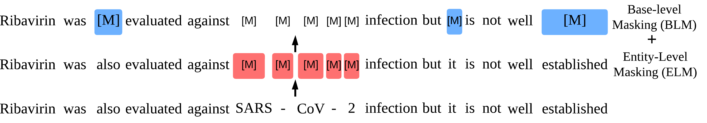

#  <p align=center>`MSLM`</p>

#### Domain Sensitive Fine-tuning: 
Improving Pre-trained Language Model Sensitivity via Mask Specific losses: A case study on Biomedical NER

## Requirements

* Python 3.8+
* transformers 4.31.0
* torch 2.0.1

## Data
[BLURB](https://huggingface.co/datasets/EMBO/BLURB) benchmark dataset

### Data Preparation

```
python utils.py \
    [path to data] \
    [storage or destination directory]
```
Alternatively inherit pre-processed BLURB datasets such as,
* [BLURB](https://microsoft.github.io/BLURB/sample_code/data_generation.tar.gz)


### Masking
#### Our proposed Joint ELM-BLM masking approach


#### [PMI](https://github.com/AI21Labs/pmi-masking) masking
```
Construct a vocabularly from a dataset using the masking approach 

 ./run_pmi.sh
```


## Fine-tuning
```
Specify the paths to the data and set the masking budgets for both the Base level masking BLM and the Entity level masking ELM

./run_train.sh [DATASET]
```

## Citation
```
@article{abaho2024improving,
  title={Improving Pre-trained Language Model Sensitivity via Mask Specific losses: A case study on Biomedical NER},
  author={Abaho, Micheal and Bollegala, Danushka and Leeming, Gary and Joyce, Dan and Buchan, Iain E},
  journal={arXiv preprint arXiv:2403.18025},
  year={2024}
}